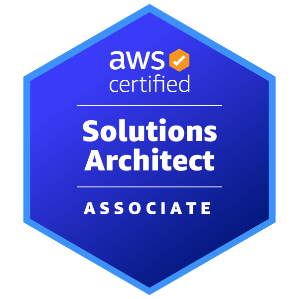
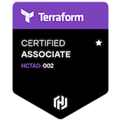
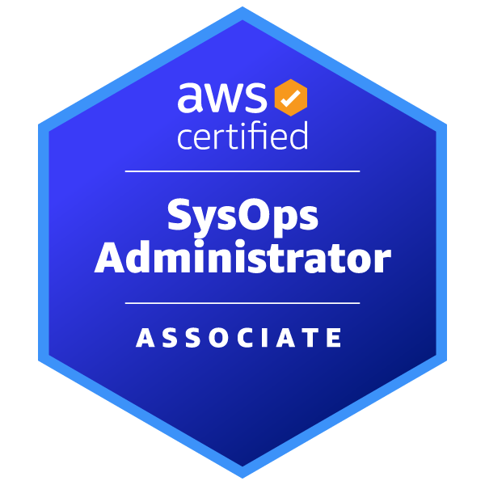
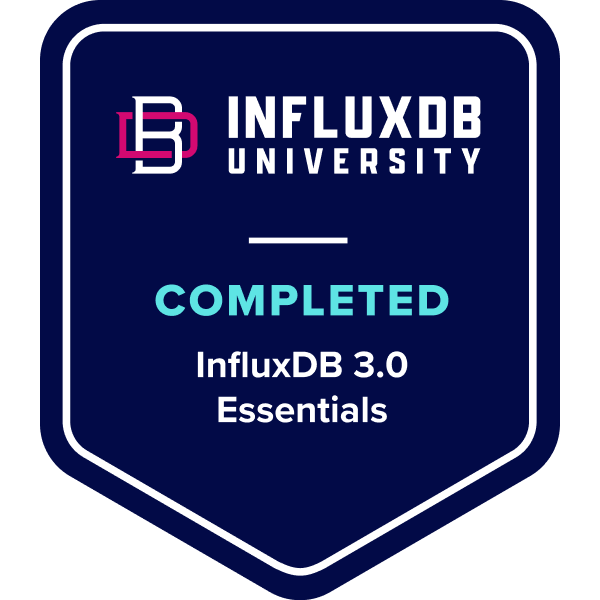

### Hi there, I'm <a target="_blank">Aman Singh</a> 

[](https://linkedin.com/in/akingsukh)
[](https://amansingh41.medium.com/)
[](https://dev.to/amaze_singh41)
[](https://wakatime.com/@35038c5c-2f2d-4e2a-975d-d3fd07993cd8)

### Glad to see you here! &nbsp; 

### 🚀 Innovative DevOps Engineer | AWS | GCP |Solutions Architect | Orchestrating Excellence

<p> Embarking on a journey of technological excellence, I am a seasoned DevOps Engineer with a relentless passion for optimizing cloud infrastructure and pioneering cutting-edge solutions. With over four years of hands-on experience, I bring a wealth of expertise in architecting resilient systems on AWS, GCP, and Azure. </p>

### 🔧 Strategic Skill Set:

- ☁ Cloud Mastery: AWS, GCP, Azure
- 🛠 DevOps Prowess: Terraform, Jenkins, GitHub Actions
- 🚀 Container Expertise: Kubernetes, Helm
- 🔐 Security Authority: Regula, Cloud Custodian, Open Agent Policy
- 🔄 Automation Maestro: IaC (Terraform), Python
- 📊 Observability Guru: Grafana, CloudWatch
- 👾 Compliance Connoisseur: SOC2, MAS TRM, CIS, HIPAA

### 🎓 Certification Accolades:
- 🏆 AWS Certified Solutions Architect
- 🏆GCP Professional
- 🏆 Terraform Associate
- 🎩 Red Hat Certified System Administrator
- 🚀 System Engineer, OpenStack Administrator
- 💡 Pinnacle Achievements:

- 🌐 Architected and executed seamless multi-cloud deployments, harnessing the prowess of AWS, GCP, and Azure.
- 🤖 Automated CI/CD pipelines with finesse using GitHub Actions and Jenkins, elevating software delivery efficiency.
- 🛡 Implemented ironclad security measures employing Regula, Cloud Custodian, and Open Agent Policy.
- 🌍 Spearheaded Kubernetes cluster deployments through Helm, ensuring unmatched scalability and reliability.
- 🚀 Pioneered infrastructure compliance on GCP with tf-validator, crafting Rego policies that redefine security benchmarks.

### 🔗 Elevate with Connection:
<p> I thrive on challenges that demand innovation and excellence at every turn. If you share a passion for pushing the boundaries of what's possible in DevOps, let's connect. Open to collaborations, discussions, and networking opportunities that drive transformative change. </p>


  

**Talking about Personal Stuff:**

- 👨🏻‍💻 I’m currently working on something cool;
- 🚀 I’m currently learning **Typescript** and **Ansible**
- 💬 Ask me about anything, I am happy to help;
- 📫 How to reach me: aman_singh41@outlook.com
- Latest Working on: [IOT Automation](https://akingsukh.medium.com/aws-sdk-iot-create-things-using-github-workflow-dispatcher-f949a4547c15)

</br>
</br>
</br>
</br>
</br>
</br>
<p align="center">






</br>
</br>
📈 **My GitHub Stats:**
<!--START_SECTION:waka-->

```txt
YAML           3 hrs 24 mins   ██████▓░░░░░░░░░░░░░░░░░░   26.80 %
Terraform      3 hrs 10 mins   ██████▒░░░░░░░░░░░░░░░░░░   24.94 %
Python         2 hrs 29 mins   █████░░░░░░░░░░░░░░░░░░░░   19.49 %
JSON           2 hrs 1 min     ████░░░░░░░░░░░░░░░░░░░░░   15.95 %
HCL            30 mins         █░░░░░░░░░░░░░░░░░░░░░░░░   03.97 %
```

<!--END_SECTION:waka-->
<p align="center"> <a href="https://github-profile-trophy.vercel.app/?username=amansingh14&margin-w=15"></a> </p>
